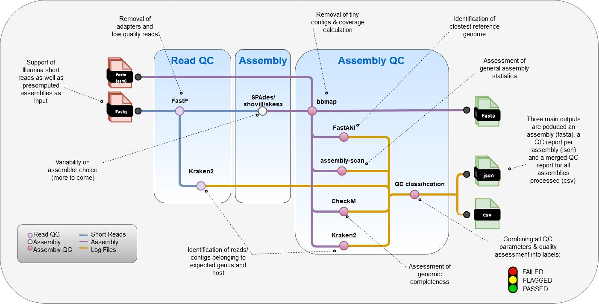

[](https://www.nextflow.io/)
[](https://docs.conda.io/en/latest/)
[](https://www.docker.com/)
[](https://sylabs.io/docs/)
[](https://tower.nf/launch?pipeline=https://github.com/gari/gari)

# Generic Assembly and Reconstruction pIpeline (GARI)

## Introduction

**G**eneric **A**ssembly and **R**econstruction p**I**peline (GARI)

Nextflow pipeline for the de novo genome reconstruction of bacterial pathogens.
The pipeline comprises of the following steps/modules:
1. Read QC
	- [fastp](https://github.com/OpenGene/fastp) to remove remaining adapters and perform very basic quality trimming
	- [Kraken2](https://github.com/DerrickWood/kraken2) to check for contamination
2. Genome Assembly/Reconstruction
	- [spades](https://github.com/ablab/spades) (default) / [shovill](https://github.com/tseemann/shovill) / [skesa](https://github.com/ncbi/SKESA)
3. Assembly QC
	- [bbrename](https://sourceforge.net/projects/bbmap/) to rename contigs and remove contigs < 200bp (default value)
	- [bbmap](https://sourceforge.net/projects/bbmap/) to remap the reads to the assembly and calculate coverage, etc.
	- [assembly-scan](https://github.com/rpetit3/assembly-scan) to produce general assembly statistics
	- [Kraken2](https://github.com/DerrickWood/kraken2) to check for contamination
	- [skani](https://github.com/bluenote-1577/skani) to identify the reference genome with the highest nucleotide identity.
	- [CheckM](https://github.com/Ecogenomics/CheckM) to check for genomic completeness and contamination using conserved single-copy core genes
4. Classification combining read & assembly parameters  


<p align="center"><picture></picture></p>

<!-- TODO nf-core:
   Complete this sentence with a 2-3 sentence summary of what types of data the pipeline ingests, a brief overview of the
   major pipeline sections and the types of output it produces. You're giving an overview to someone new
   to nf-core here, in 15-20 seconds. For an example, see https://github.com/nf-core/rnaseq/blob/master/README.md#introduction
-->

<!-- TODO nf-core: Include a figure that guides the user through the major workflow steps. Many nf-core
     workflows use the "tube map" design for that. See https://nf-co.re/docs/contributing/design_guidelines#examples for examples.   -->
<!-- TODO nf-core: Fill in short bullet-pointed list of the default steps in the pipeline -->

## Usage

> **Note**
> If you are new to Nextflow and nf-core, please refer to [this page](https://nf-co.re/docs/usage/installation) on how
> to set-up Nextflow. Make sure to [test your setup](https://nf-co.re/docs/usage/introduction#how-to-run-a-pipeline)
> with `-profile test` before running the workflow on actual data. (NOT SETUP YET...)


Now, you can install the pipeline using:

```bash
# get the most recent pipeline version (the same command updates the pipeline)
nextflow pull rki-mf1/GARI
# check the available release versions and development branches
nextflow info rki-mf1/GARI
# select a recent release and run
nextflow run rki-mf1/GARI -r v1.2.0 -profile <singularity, docker, conda, mamba> -params-file params.yaml
```

Another option is to clone the repository and run the pipeline but we recommend using the `nextflow pull` option and stable release versions via `-r`. 


The pipeline needs a few input parameters to be defined. This can be done either directly in the command line, or via a parameter file (params.yaml as in the command above). Using a params file is advised. Here is a minimum example of a params file with the required parameters:

`params.yaml`:
```
input: '/path/to/input/samplesheet.csv'
outdir: '/path/to/output'
skani_db: '/path/to/skani_database'
```

The additional flags in the command e.g. "-profile" will define how the pipeline is executed e.g. singularity, conda, mamba or docker (we recommend using singularity, if available). 
When executing the pipeline on a HPC with a queuing system you might want to limit the amount of jobs submitted in parallel you can use the option "-queue-size 20" to limit the jobs submitted to the queue to 20 in the nextflow command above.


## Inputs:
### Parameters and Filter Options

| name |  required (to set by user) |  description | type in config  | default value |
|---|---|---|---|---|
| input | YES | path to input samplesheet in csv format (more detailed explanation below) | string | null |
| outdir | YES | path to output directory | string | null |
| skani_db | YES | path to precomputed skani database to use fro reference/species verification | string | null |
| kraken_db | NO | path to precomputed Kraken2 database to use for classification | string | null (will download and use the babykraken DB if no local DB is specified) |
| tmp_dir | NO | path to temp directory (used for some processes) | string | /tmp/ |
| qc_mode | NO | if set to true expects assemblies as input and only performs QC | boolean | false |
| preset | NO | predefined preset settings to use (more details below) | string | |
| assembler | NO | assembler to use (options: 'spades',  'shovill' or 'skesa')| string | 'spades' |
| checkm_db | NO | path to local copy of checkM database, if not set checkM downloads the database itself | string | |
| min_size | NO | minimum contig size to filter out/remove | integer | 200 |
| fastp_params | NO | additional parameters to add to the FASTP command | string | '--detect_adapter_for_pe' |
| assemblyscan_params | NO | additional parameters to add to the assembly_scan command | string | '--json' (json flag required for QC assessment!) |
| krakenR_params | NO |  additional parameters to add to the KRAKEN2 command assessing reads | string | '--minimum-base-quality 10 --minimum-hit-groups 3 --confidence 0.05' |
| krakenA_params | NO |  additional parameters to add to the KRAKEN2 command assessing assemblies | string | '--minimum-base-quality 10 --minimum-hit-groups 3 --confidence 0.05' |
| spades_params | NO |  additional parameters to add to the SPADES command | string | '--isolate' |
| shovill_params | NO |  additional parameters to add to the SHOVILL command | string | |
| skesa_params | NO |  additional parameters to add to the SKESA command | string | |
| skani_params | NO |  additional parameters to add to the skani command | string | '--mode genome'  |
| thresholds | NO |---| path to thresholds in json format used for QC assessment | 'assets/QC_thresholds.json' |
| publish_dir_enabled | NO |---| boolean | false |
| publish_dir_mode | NO |---| string | 'copy' |


### Detailed walkthrough 
First, prepare a samplesheet with your **input** data that looks as follows, with each row representing a pair of fastq files (paired end):
`samplesheet.csv`:
```csv
sample,fastq_1,fastq_2,species
S1,/path/to/S1_R1.fastq.gz,/path/to/S1_R2.fastq.gz,Escherichia coli
S2,/path/to/S2_R1.fastq.gz,/path/to/S2_R2.fastq.gz,Acinetobacter baumannii
...
```
A samplesheet like the one shown above can be created using the python script 'createSampleSheet_GARI.py' within the bin folder. 
Given a directory containing paired-end reads and a seperator/delimiter to reduce the filename to a sampleID this script will create a samplesheet directly usable for GARI (for more information on usage check the help function of the python script). If no species information can or is provided the species field will be filled with NA. In this case no comparison to the identified reference will be performed.
When run in QC-mode (--qc_mode true) assemblies need to be provided as an input in the samplesheet. For this purpose assemblies are added the the fastq_1 column while the fastq_2 column is left empty. A **samplesheet in QC-mode** would look like:
```csv
sample,fastq_1,fastq_2,species
S1,/path/to/S1_ASM.fasta,,Escherichia coli
S2,/path/to/S2_ASM.fasta,,Acinetobacter baumannii
...
```
The **kraken_db** is the path of the Kraken2 database used to classify reads and assembly. Some precomputed Kraken2 databses can be found [here](https://benlangmead.github.io/aws-indexes/k2).

The **skani_db** is the path of the skani database used to check and identify the closest reference genome. We recommend the use of the GTDB database. A link to precomputed databases as well as a tutorial on how to set up a local version can be found [here](https://github.com/bluenote-1577/skani/wiki/Tutorial:-setting-up-the-GTDB-genome-database-to-search-against).

> **Warning:**
> Please provide pipeline parameters via the CLI or Nextflow `-params-file` option. Custom config files including those
> provided by the `-c` Nextflow option can be used to provide any configuration _**except for parameters**_;
> see [docs](https://nf-co.re/usage/configuration#custom-configuration-files).

## Thresholds and QC filters:
GARI outputs a variety of assembly and assembly quality statistics that can be found in the final GARI QC report. A subset of these values is used to "classify" each generated assembly into the categories: "PASSED", "FLAGGED" and "FAILED". \

Here is an overview of parameters and thresholds used for the assessment:

| parameter | only species specific | default threshold | description |
|---|---|---|---|
flag_max_total_contigs | NO | 500 | - |
flag_AvgCov | NO | 50 | - |
fail_AvgCov | NO | 30 | - |
flag_PercMapped | NO | 95 | - |
flag_ref_ident | NO | 90 | - |
flag_checkM_complete | NO | 98 | - |
fail_checkM_complete | NO | 95 | - |
flag_checkM_contamination | NO | 2 | - |
fail_checkM_contamination | NO | 10 | - |
flag_krakenTarget | NO | 60 | - |
flag_krakenHost | NO | 5 | - |
flag_max_length | YES | - | - |
fail_max_length | YES | - | - | 
flag_min_length | YES | - | - |
fail_min_length | YES | - | - |
flag_max_GC |  YES | - | - |
flag_min_GC | YES | - | - |

Thresholds are defined in the file [`QC_thresholds.json`](assets/QC_thresholds.json) within the GARI assests folder. Species specific thresholds are defined for 56 relevant bacterial pathogens. These species specific thresholds were calculated using complete RefSeq genomes from NCBI. Thresholds to flag assemblies are generally based on the 10/90% quantiles of the RefSeq assemblies while thresholds to fail assemblies are based on the 0/100% quantiles. \
Feel free to add a new species to QC_thresholds.json if needed. 

## Presets:
GARI allows to define presets of run wide parameters. This is mostly useful when running GARI with specific settings that should be also be applied to a later dataset, so the parameters don't need to be specified for each run. \
Such presets are defined in the [`presets.config`](conf/presets.config) within the config folder. Defining the preset parameter to any string defined in the presets.config will automatically load these setting and apply them to the run of GARI. 
Feel free to define new presets within bin/presets.config if needed.

## HPC & QOL

When running GARI on the HPC you need to set the executor to use slurm. This can be done either in a configfile provided via -c <file.config> or by defining it in e.g. your .bashrc like:
```
export NXF_EXECUTOR=slurm
```
Additionally you can set the directory where singularity images used to run nextflow modules are cached, so they can be reused and do not need to be downloaded for each execution of GARI:
```
export NXF_SINGULARITY_CACHEDIR='/path/to/NEXTFLOW_CACHE_folder/'
```

## Credits

GARI was originally written by Maximilian Driller.

We thank the following people for their extensive assistance in the development of this pipeline:

Caroline Roschek, Silver A. Wolf, Torsten Houwaart, Lakshmipriya Thrukonda, Vladimir Bajić and Mustafa Helal

<!-- TODO nf-core: If applicable, make list of people who have also contributed -->

## Citations

<!-- TODO nf-core: Add citation for pipeline after first release. Uncomment lines below and update Zenodo doi and badge at the top of this file. -->
<!-- If you use  gari/gari for your analysis, please cite it using the following doi: [10.5281/zenodo.XXXXXX](https://doi.org/10.5281/zenodo.XXXXXX) -->

<!-- TODO nf-core: Add bibliography of tools and data used in your pipeline -->

An extensive list of references for the tools used by the pipeline can be found in the [`CITATIONS.md`](CITATIONS.md) file.

This pipeline uses code and infrastructure developed and maintained by the [nf-core](https://nf-co.re) community, reused here under the [MIT license](https://github.com/nf-core/tools/blob/master/LICENSE).

> **The nf-core framework for community-curated bioinformatics pipelines.**
>
> Philip Ewels, Alexander Peltzer, Sven Fillinger, Harshil Patel, Johannes Alneberg, Andreas Wilm, Maxime Ulysse Garcia, Paolo Di Tommaso & Sven Nahnsen.
> _Nat Biotechnol._ 2020 Feb 13. doi: [10.1038/s41587-020-0439-x](https://dx.doi.org/10.1038/s41587-020-0439-x).
>
> Shifu Chen, Yanqing Zhou, Yaru Chen, Jia Gu, fastp: an ultra-fast all-in-one FASTQ preprocessor, Bioinformatics, Volume 34, Issue 17, September 2018, Pages i884–i890, https://doi.org/10.1093/bioinformatics/bty560
>
>  Prjibelski, A., Antipov, D., Meleshko, D., Lapidus, A., & Korobeynikov, A. (2020). Using SPAdes de novo assembler. Current Protocols in Bioinformatics, 70, e102. doi: 10.1002/cpbi.102 
>
> Wood, D.E., Lu, J. & Langmead, B. Improved metagenomic analysis with Kraken 2. Genome Biol 20, 257 (2019). https://doi.org/10.1186/s13059-019-1891-0
>
> Parks DH, Imelfort M, Skennerton CT, Hugenholtz P, Tyson GW. CheckM: assessing the quality of microbial genomes recovered from isolates, single cells, and metagenomes. Genome Res. 2015 Jul;25(7):1043-55. doi: 10.1101/gr.186072.114. Epub 2015 May 14. PMID: 25977477; PMCID: PMC4484387.
>
> Prjibelski, A., Antipov, D., Meleshko, D., Lapidus, A., & Korobeynikov, A. (2020). Using SPAdes de novo assembler. Current Protocols in Bioinformatics, 70, e102. doi: 10.1002/cpbi.102 
>
> Souvorov, A., Agarwala, R. & Lipman, D. SKESA: strategic k-mer extension for scrupulous assemblies. Genome Biol 19, 153 (2018). https://doi.org/10.1186/s13059-018-1540-z
>
> Jim Shaw and Yun William Yu. Fast and robust metagenomic sequence comparison through sparse chaining with skani. Nature Methods (2023). https://doi.org/10.1038/s41592-023-02018-3